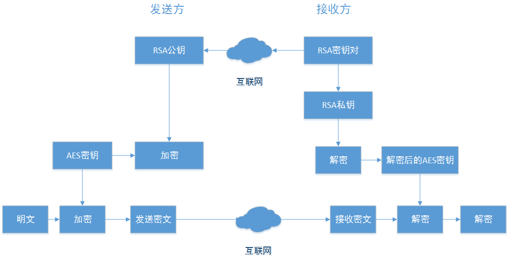

AES与RSA相结合数据加密方案
    RSA算法是公开密钥系统的代表，其安全性建立在具有大素数因子的合数，其因子分解困难这一法则之上的。
    Rijndael算法作为新一代的高级加密标准，运行时不需要计算机有非常高的处理能力和大的内存，
    操作可以很容易的抵御时间和空间的攻击，在不同的运行环境下始终能保持良好的性能。
    这使AES将安全，高效，性能，方便，灵活性集于一体，理应成为网络数据加密的首选。
    相比较，因为AES密钥的长度最长只有256比特，可以利用软件和硬件实现高速处理，而RSA算法需要进行大整数的乘幂和求模等多倍字长处理，处理速度明显慢于AES[5]；
    所以AES算法加解密处理效率明显高于RSA算法。
    在密钥管理方面，因为AES算法要求在通信前对密钥进行秘密分配，解密的私钥必须通过网络传送至加密数据接收方，而RSA采用公钥加密，私钥解密（或私钥加密，公钥解密），加解密过程中不必网络传输保密的密钥；
    所以RSA算法密钥管理要明显优于AES算法。
    从上面比较得知，由于RSA加解密速度慢，不适合大量数据文件加密，因此在网络中完全用公开密码体制传输机密信息是没有必要，也是不太现实的。
    AES加密速度很快，但是在网络传输过程中如何安全管理AES密钥是保证AES加密安全的重要环节。这样在传送机密信息的双方，如果使用AES对称密码体制对传输数据加密，
    同时使用RSA不对称密码体制来传送AES的密钥，就可以综合发挥AES和RSA的优点同时避免它们缺点来实现一种新的数据加密方案。

**加密解密方案如图**

请求：
1. 服务器端(server)和客户端(client)分别生成自己的密钥对
2. server和client分别交换自己的公钥
3. client生成AES密钥(aesKey)
4. client使用自己的RSA私钥(privateKey)对请求明文数据(params)进行数字签名
5. 将签名加入到请求参数中，然后转换为json格式
6. client使用aesKey对json数据进行加密得到密文(data)
7. client使用sever的RSA公钥对aesKey进行加密(encryptkey)
8. 分别将data和encryptkey作为参数传输给服务器端
    服务器端进行请求响应时将上面流程反过来即可